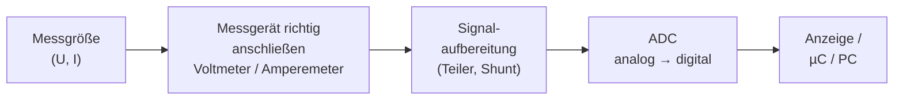
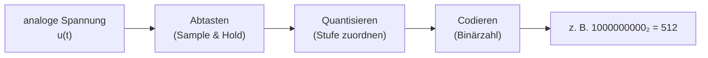
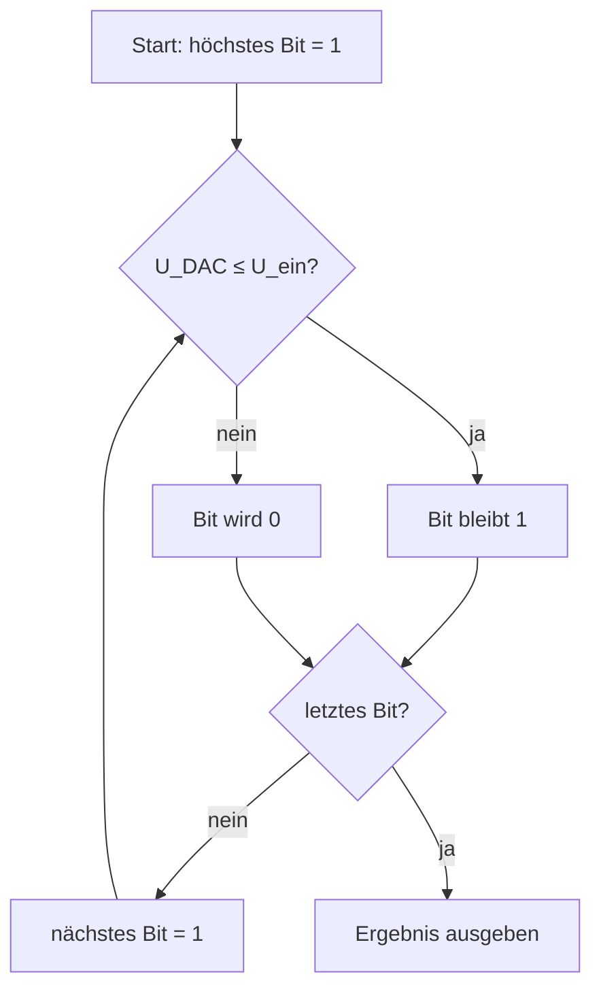
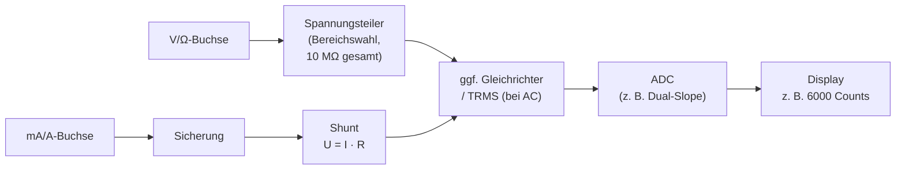

# Folieninhalt & Darstellungsvarianten

> [!info] So ist dieses Dokument aufgebaut
> Jede Folie hat dieselbe Struktur:
> 1. **Kernaussage** – der *eine* Satz, den das Publikum mitnehmen soll (gut als Folientitel oder Highlight-Box).
> 2. **Folieninhalt** – das, was tatsächlich auf die Folie gehört (max. 3–5 Stichpunkte).
> 3. **Darstellungsvarianten** – 2–3 Layout-Ideen zur Inspiration für die Firmenvorlage.
> 4. **Sprechernotiz** – was du dazu *sagst* (nicht auf die Folie schreiben!).
> 5. **Zeit** – Richtwert für die 15-Min-Fassung | 10-Min-Fassung.
>
> Folien mit `⏩ OPTIONAL` werden für die 10-Min-Fassung **komplett gestrichen**. Folien mit `✂️ KÜRZBAR` bleiben, aber du sprichst nur die fett markierten Punkte.

## Zeitplan auf einen Blick

| Nr. | Folie | 15 Min | 10 Min | Status |
|---:|---|---:|---:|---|
| 1 | Titel | 0:20 | 0:15 | fix |
| 2 | Roter Faden: Die Messkette | 0:40 | 0:30 | fix |
| 3 | Warum das Thema? | 0:45 | 0:30 | ✂️ kürzbar |
| 4 | Voltmeter | 1:15 | 1:00 | fix |
| 5 | Amperemeter | 1:15 | 1:00 | fix |
| 6 | Messbereichserweiterung | 1:00 | – | ⏩ optional |
| 7 | Spannungs- vs. stromrichtige Messung | 0:45 | – | ⏩ optional |
| 8 | Sicherheit beim Messen | 1:00 | 0:45 | ✂️ kürzbar |
| 9 | ADC – die Grundidee | 1:00 | 0:50 | fix |
| 10 | Auflösung & LSB | 1:15 | 1:00 | fix |
| 11 | Abtasttheorem & Aliasing | 1:00 | 0:50 | ✂️ kürzbar |
| 12 | Wandlerverfahren im Vergleich | 1:15 | 1:00 | fix |
| 13 | SAR Schritt für Schritt | 1:00 | – | ⏩ optional |
| 14 | Alles zusammen: Das Digitalmultimeter | 1:15 | 1:00 | fix |
| 15 | Fazit & Fragen | 0:45 | 0:30 | fix |
| | **Summe** | **14:30** | **9:10** | |

> [!tip] Puffer
> Die 15-Min-Fassung hat 30 s Puffer, die 10-Min-Fassung 50 s. Wenn du merkst, dass du zu langsam bist: Folie 13 → 7 → 6 in dieser Reihenfolge überspringen („Das zeige ich bei Rückfragen gern im Detail“).

---

## Folie 1 – Titel

**Kernaussage:** –

**Folieninhalt**
- Titel: **Vom Messwert zur Zahl**
- Untertitel: *Voltmeter, Amperemeter und Analog-Digital-Wandler*
- Name, Ausbildungsberuf/Jahrgang, Datum (02.10.2026)
- Modul: Ausbildungsinhalte 022 – Grundlagen der Elektrotechnik

**Darstellungsvarianten**
- **A – Klassisch:** Titel-Layout der Firmenvorlage, rechts ein Foto eines Digitalmultimeters.
- **B – Bildstark:** Vollflächiges Bild: links eine Sinuskurve, rechts dieselbe Kurve als „Treppe“, Titel darüber.
- **C – Frage als Titel:** „Wie kommt eine Spannung auf ein Display?“ (macht neugierig, Titel dann im Untertitel).

**Sprechernotiz**
> „Guten Morgen! Ich zeige euch heute, was eigentlich passiert, wenn wir mit dem Multimeter messen – und wie aus einer analogen Spannung am Ende eine Zahl auf dem Display wird.“

**Zeit:** 0:20 | 0:15

---

## Folie 2 – Roter Faden: Die Messkette

**Kernaussage:** Jeder digitale Messwert durchläuft dieselbe Kette – und meine drei Themen sind Glieder dieser Kette.

**Folieninhalt**



- Teil 1: **Voltmeter & Amperemeter** – wie wird gemessen?
- Teil 2: **Analog-Digital-Wandler** – wie wird daraus eine Zahl?
- Teil 3: **Alles zusammen** im Digitalmultimeter

**Darstellungsvarianten**
- **A – Prozesspfeil:** 5 Kästen als horizontaler Chevron-Pfeil (SmartArt „Prozess“ in PowerPoint). Die Kästen 2 und 4 farbig hervorheben = „meine Themen“.
- **B – Agenda + Mini-Grafik:** Links klassische Agenda (3 Punkte), rechts kleine Messkette als Icon-Leiste.
- **C – Wiederkehrendes Navigationselement:** Die Messkette als schmale Leiste oben auf *jeder* Folie; das aktuelle Glied ist hervorgehoben (gibt Orientierung, wirkt sehr professionell).

**Sprechernotiz**
> „Egal ob Multimeter, Handy oder Steuergerät im Auto – ein digitaler Messwert entsteht immer in dieser Kette. Zuerst muss ich richtig anschließen, dann wird das Signal angepasst, dann wandelt ein ADC es in eine Zahl um. Genau an diesen Stellen setzen meine Themen an.“

**Zeit:** 0:40 | 0:30

---

## Folie 3 – Warum das Thema? `✂️ KÜRZBAR`

**Kernaussage:** Die Welt ist analog, Rechner sind digital – der ADC ist die Brücke.

**Folieninhalt**
- Physikalische Größen sind **analog**: stufenlos, unendlich viele Zwischenwerte (Temperatur, Druck, Spannung)
- Mikrocontroller & PCs verarbeiten nur **digitale** Werte (endlich viele Zahlen)
- Beispiele aus dem Alltag: **Multimeter**, Handy-Mikrofon, Temperatursensor im Steuergerät, Arduino `analogRead()`

**Darstellungsvarianten**
- **A – Zweispaltig „Analog | Digital“:** Links Sinuskurve + Beispiele, rechts Treppenkurve/Binärzahlen + Beispiele, in der Mitte ein Brücken-Icon „ADC“.
- **B – Icon-Raster:** 4 Icons (Multimeter, Mikrofon, Thermometer, Mikrocontroller) mit je einem Wort.
- **C – Einstiegsfrage:** Nur eine große Frage auf der Folie: „Wie viele Werte liegen zwischen 0 V und 1 V?“ → Antwort analog: unendlich viele; digital (10 Bit): 205.

> [!note] Zahl für Variante C geprüft
> 10-Bit-ADC, $U_\text{ref}$ = 5 V: 1 V entspricht $1 \cdot 1024 / 5 = 204{,}8$ → Codes 0 … 204 = 205 Werte.

**Sprechernotiz**
> „Eine Spannung kann jeden beliebigen Wert annehmen – 1,0 V, 1,01 V, 1,0001 V … Ein Computer kennt aber nur Zahlen mit endlich vielen Stellen. Irgendwo muss also übersetzt werden – das macht der Analog-Digital-Wandler, kurz ADC oder ADU.“
>
> **10-Min-Fassung:** nur den ersten Satz + „das macht der ADC“.

**Zeit:** 0:45 | 0:30

---

## Folie 4 – Voltmeter: Parallel & hochohmig

**Kernaussage:** Ein Voltmeter wird **parallel** zum Bauteil angeschlossen und muss **sehr hochohmig** sein, damit es die Schaltung nicht verfälscht.

**Folieninhalt**
- Anschluss **parallel** zum Messobjekt
- Ideal: $R_i \rightarrow \infty$ (es fließt kein Messstrom)
- Real: Digitalmultimeter typ. **10 MΩ** Eingangswiderstand
- Problem bei hochohmigen Schaltungen: **Belastungsfehler**

**Rechenbeispiel (Belastungsfehler)**

Spannungsteiler $R_1 = R_2 = 1\,\text{M}\Omega$ an $U = 10\,\text{V}$ → ideal $U_2 = 5{,}00\,\text{V}$

| Messgerät | Innenwiderstand | $R_2 \parallel R_i$ | angezeigt | Fehler |
|---|---|---|---|---|
| ideal | ∞ | 1 MΩ | 5,00 V | 0 % |
| Digitalmultimeter | 10 MΩ | 0,909 MΩ | **4,76 V** | −4,8 % |
| Analoges Zeigerinstrument (20 kΩ/V, 10-V-Bereich) | 200 kΩ | 0,167 MΩ | **1,43 V** | −71 % |

**Darstellungsvarianten**
- **A – Schaltbild + Merksatz:** Links Schaltbild (Quelle, R1, R2, Voltmeter parallel zu R2), rechts Highlight-Box „Parallel & hochohmig“.
- **B – Schaltbild + Tabelle:** Wie A, aber unten die Tabelle mit nur zwei Zeilen (ideal / DMM). Die 1,43-V-Zeile als „Aha-Moment“ per Animation einblenden.
- **C – Analogie:** Foto/Icon eines Reifendruckprüfers: „Ein gutes Messgerät lässt fast keine Luft raus.“

**Schaltbild-Skizze (ASCII, zum Nachbauen)**
```
   +10V ──┬── R1 (1 MΩ) ──┬──────────┐
          │               │          │
         (U)            R2 (1 MΩ)   (V)  ← Voltmeter parallel zu R2
          │               │          │
    GND ──┴───────────────┴──────────┘
```

**Sprechernotiz**
> „Ein Voltmeter messe ich immer parallel – ich greife die Spannung zwischen zwei Punkten ab. Damit es die Schaltung nicht beeinflusst, soll möglichst kein Strom durchs Messgerät fließen, also: Innenwiderstand möglichst groß. Ein normales Multimeter hat etwa 10 Megaohm. Das reicht meistens – aber nicht immer: Bei diesem Spannungsteiler mit je einem Megaohm zeigt das Multimeter nur 4,76 statt 5 Volt an, weil sein Innenwiderstand parallel zu R2 liegt. Ein altes Zeigerinstrument würde sogar nur 1,4 Volt anzeigen.“

**Zeit:** 1:15 | 1:00

---

## Folie 5 – Amperemeter: In Reihe & niederohmig

**Kernaussage:** Ein Amperemeter wird **in Reihe** geschaltet und muss **sehr niederohmig** sein – intern misst es meist eine kleine Spannung an einem Shunt.

**Folieninhalt**
- Anschluss **in Reihe**: Stromkreis auftrennen, der gesamte Strom fließt durchs Messgerät
- Ideal: $R_i \rightarrow 0$ (kein Spannungsabfall)
- Prinzip im Digitalmultimeter: **Shunt-Widerstand** → $U_\text{Shunt} = I \cdot R_\text{Shunt}$ → Spannung wird gemessen
- Real: Spannungsabfall am Messgerät = **Bürdenspannung** (verfälscht kleine Spannungen/Ströme)

**Rechenbeispiel (Bürdenspannung)**
Last 25 Ω an 5 V → ideal $I = 200\,\text{mA}$. Mit 1 Ω Shunt im Messgerät: $I = 5\,\text{V} / 26\,\Omega = 192\,\text{mA}$ (−3,8 %), am Messgerät fallen 0,19 V ab.

**Darstellungsvarianten**
- **A – Schaltbild „aufgetrennt“:** Stromkreis mit Unterbrechung, Amperemeter in die Lücke gesetzt; daneben Merksatz „In Reihe & niederohmig“.
- **B – Gegenüberstellung als Tabelle** (sehr gut als Abschluss von Folie 4+5 kombinierbar):

  | | Voltmeter | Amperemeter |
  |---|---|---|
  | Anschluss | parallel | in Reihe |
  | idealer $R_i$ | ∞ | 0 |
  | real (DMM) | ≈ 10 MΩ | Shunt, ≈ mΩ … Ω |
  | Fehlerquelle | Belastung (Messstrom) | Bürdenspannung |
  | Merkhilfe | „greift ab“ | „liegt im Weg“ |

- **C – Analogie Wasserrohr:** Durchflussmesser muss *ins* Rohr eingebaut werden (Strom), Drucksensor wird *seitlich* angeschlossen (Spannung).

**Sprechernotiz**
> „Für den Strom muss ich den Stromkreis auftrennen und das Messgerät hineinsetzen – in Reihe. Hier ist es genau umgekehrt: Das Messgerät soll möglichst *keinen* Widerstand haben, sonst bremst es den Strom. Intern macht das Multimeter einen Trick: Es schickt den Strom durch einen kleinen, genau bekannten Widerstand, den Shunt, und misst die Spannung daran. Nach dem Ohmschen Gesetz ist I = U durch R. Das heißt: Auch ein Amperemeter ist im Inneren eigentlich ein Voltmeter!“

**Zeit:** 1:15 | 1:00

---

## Folie 6 – Messbereichserweiterung `⏩ OPTIONAL`

**Kernaussage:** Mit einem Vorwiderstand (Voltmeter) bzw. einem Parallelwiderstand/Shunt (Amperemeter) kann ein Messwerk größere Werte messen.

**Folieninhalt**
- Erweiterungsfaktor $n = \dfrac{\text{neuer Messbereich}}{\text{alter Messbereich}}$
- Voltmeter → **Vorwiderstand in Reihe:** $R_V = (n-1) \cdot R_i$
- Amperemeter → **Nebenwiderstand (Shunt) parallel:** $R_N = \dfrac{R_i}{n-1}$

**Rechenbeispiel** – Messwerk: Vollausschlag 100 µA, $R_i$ = 1 kΩ (→ 100 mV Vollausschlag)

| Ziel | n | Formel | Ergebnis |
|---|---|---|---|
| Voltmeter 10 V | 100 | $R_V = 99 \cdot 1\,\text{k}\Omega$ | **99 kΩ** |
| Amperemeter 10 mA | 100 | $R_N = 1\,\text{k}\Omega / 99$ | **≈ 10,1 Ω** |

**Darstellungsvarianten**
- **A – Zwei Schaltbilder nebeneinander** (Messwerk + $R_V$ in Reihe | Messwerk + $R_N$ parallel), Formeln darunter.
- **B – Nur Tabelle mit Beispiel** (wenn die Zeit knapp ist und das Publikum die Formeln kennt).
- **C – Merkhilfe-Grafik:** „Spannung → Reihe teilt die Spannung“, „Strom → Parallel teilt den Strom“.

**Sprechernotiz**
> „Wie kommt ein Messgerät überhaupt zu verschiedenen Messbereichen? Beim Voltmeter schalte ich einen Vorwiderstand in Reihe – der übernimmt den Großteil der Spannung. Beim Amperemeter schalte ich einen Shunt parallel – der übernimmt den Großteil des Stroms. Beispiel: Ein Messwerk mit 100 µA und 1 kΩ soll 10 V messen: Faktor 100, also 99 kΩ Vorwiderstand.“

**Zeit:** 1:00 | –

---

## Folie 7 – Spannungsrichtige vs. stromrichtige Messung `⏩ OPTIONAL`

**Kernaussage:** Misst man U und I gleichzeitig, verfälscht immer eines der beiden Geräte den anderen Messwert – die Schaltung wählt man nach der Größe des Widerstands.

**Folieninhalt**
- **Spannungsrichtig** (Voltmeter direkt am Bauteil): U korrekt, I etwas zu groß → für **kleine** Widerstände ($R \ll R_{i,V}$)
- **Stromrichtig** (Amperemeter direkt am Bauteil): I korrekt, U etwas zu groß → für **große** Widerstände ($R \gg R_{i,A}$)

**Darstellungsvarianten**
- **A – Zwei Schaltbilder** mit grünem Haken am jeweils „richtigen“ Messgerät.
- **B – Entscheidungsbaum:** „R klein?“ → spannungsrichtig, „R groß?“ → stromrichtig.

**Sprechernotiz**
> „Wenn ich einen Widerstand über U und I bestimmen will, kann ich das Voltmeter direkt am Widerstand oder vor dem Amperemeter anschließen. Faustregel: kleine Widerstände spannungsrichtig, große Widerstände stromrichtig – dann ist der Fehler am kleinsten.“

**Zeit:** 0:45 | –

---

## Folie 8 – Sicherheit beim Messen `✂️ KÜRZBAR`

**Kernaussage:** Das häufigste gefährliche Missgeschick: **Spannung messen, während das Gerät auf Strom steht** – das ist ein Kurzschluss.

**Folieninhalt**
- **Strommessbuchse = fast 0 Ω** → an einer Spannungsquelle angelegt = Kurzschluss → Sicherung im Messgerät
- Vor jeder Messung: **Buchse + Drehschalter + Messbereich** prüfen
- Messgerät *und* Messleitungen müssen zur **Messkategorie** passen (DIN EN 61010):

| Kategorie | Wo? | Beispiel |
|---|---|---|
| CAT I / „CAT 0“ | Kreise ohne direkte Netzverbindung | Batterie-/Elektronikschaltungen |
| CAT II | Geräte am Netz über Stecker | Haushaltsgeräte, Werkzeuge |
| CAT III | Gebäudeinstallation | Verteiler, fest angeschlossene Geräte |
| CAT IV | Ursprung der Installation | Hausanschluss, Zähler |

**Darstellungsvarianten**
- **A – Warnfolie:** Großes Warn-Icon ⚠️, ein Satz („Erst Buchse prüfen, dann messen“), Tabelle klein darunter.
- **B – Pyramide/Stufen-Grafik:** CAT I unten bis CAT IV oben („je näher an der Einspeisung, desto höher die Energie bei Fehlern“).
- **C – Foto mit Markierungen:** Multimeter-Front, Buchsen beschriftet (COM, V/Ω, mA, 10 A), Aufdruck „CAT III 600 V“ eingekreist.

**Sprechernotiz**
> „Ein Punkt, der in der Praxis wirklich wichtig ist: Wenn das Messgerät noch auf Strommessung steht und ich damit an eine Spannung gehe, mache ich einen Kurzschluss durch das Messgerät – das ist ja gewollt niederohmig. Im besten Fall fliegt die Sicherung, im schlechtesten entsteht ein Lichtbogen. Deshalb: vor jeder Messung Buchse und Drehschalter checken. Und die CAT-Angabe auf dem Gerät sagt mir, wo ich es überhaupt einsetzen darf – je näher an der Einspeisung, desto höher muss die Kategorie sein.“
>
> **10-Min-Fassung:** nur den Kurzschluss-Fall erklären, Tabelle nur zeigen.

**Zeit:** 1:00 | 0:45

---

## Folie 9 – ADC: Die Grundidee

**Kernaussage:** Ein ADC macht aus einer stufenlosen Spannung eine Zahl – in drei Schritten: **Abtasten, Quantisieren, Codieren**.

**Folieninhalt**
1. **Abtasten** (zeitlich): In festen Abständen wird ein Momentanwert „eingefroren“ (Sample & Hold)
2. **Quantisieren** (wertmäßig): Der Wert wird der nächstgelegenen Stufe zugeordnet
3. **Codieren**: Die Stufennummer wird als Binärzahl ausgegeben

**Darstellungsvarianten**
- **A – Ein Diagramm, drei Ebenen:** Sinuskurve (grau), Abtastpunkte (Punkte), Treppenkurve (farbig), rechts Binärcodes je Stufe. *(Im Beamer-Template als pgfplots-Grafik enthalten.)*
- **B – Drei-Spalten-Prozess:** drei Kästen mit Icon (Uhr = Zeit, Lineal = Wert, 0101 = Code).
- **C – Analogie Foto/Film:** Abtasten = Bilder pro Sekunde, Quantisieren = Anzahl der Farbabstufungen.



**Sprechernotiz**
> „Der ADC macht zwei Dinge gleichzeitig ‚grob‘: Er schaut nur zu bestimmten Zeitpunkten hin – das ist das Abtasten. Und er kennt nur eine begrenzte Zahl von Stufen – das ist das Quantisieren. Am Ende steht die Nummer der Stufe als Binärzahl. Aus dieser glatten Kurve wird also eine Treppe.“

**Zeit:** 1:00 | 0:50

---

## Folie 10 – Auflösung & LSB

**Kernaussage:** Die **Bitzahl** bestimmt, wie fein der ADC auflöst. Die kleinste Stufe heißt **LSB**.

**Folieninhalt**
- Anzahl der Stufen: $2^n$ (n = Bitzahl)
- Kleinste Stufe: $U_\text{LSB} = \dfrac{U_\text{ref}}{2^n}$
- Quantisierungsfehler: systembedingt **±½ LSB**
- Umrechnung: $\text{Code} = \dfrac{U_\text{ein} \cdot 2^n}{U_\text{ref}}$ (abgerundet)

| Auflösung | Stufen | LSB bei $U_\text{ref}$ = 5 V |
|---|---:|---:|
| 8 Bit | 256 | 19,5 mV |
| **10 Bit** (Arduino Uno) | **1 024** | **4,88 mV** |
| 12 Bit | 4 096 | 1,22 mV |
| 16 Bit | 65 536 | 76 µV |

**Praxisbeispiel Arduino Uno (ATmega328P, 10 Bit, $U_\text{ref}$ = 5 V)**
- 2,5 V am Eingang → $2{,}5 \cdot 1024 / 5 = 512$ → `analogRead()` liefert **512**
- `analogRead()` liefert 300 → $300 \cdot 5\,\text{V} / 1024 \approx$ **1,46 V**

**Darstellungsvarianten**
- **A – Formel + Tabelle** (wie oben) – klar und prüfungsnah.
- **B – Balkendiagramm „Stufen pro Volt“** (logarithmisch) mit hervorgehobenem 10-Bit-Balken.
- **C – Live-Rechnung:** Nur die Arduino-Frage auf die Folie („Was liefert `analogRead()` bei 2,5 V?“), Publikum kurz raten lassen, dann Lösung einblenden.

> [!warning] Genauigkeit ≠ Auflösung
> Auflösung ist nur die *Feinheit* der Stufen. Die tatsächliche Genauigkeit ist schlechter, weil Referenzspannung, Offset-, Verstärkungs- und Linearitätsfehler dazukommen. Gut für eine Rückfrage!

**Sprechernotiz**
> „Wie fein die Treppe ist, hängt von der Bitzahl ab. Ein 10-Bit-Wandler, wie im Arduino, hat 2 hoch 10, also 1024 Stufen. Bei 5 Volt Referenz ist eine Stufe knapp 4,9 Millivolt groß – das nennt man LSB, Least Significant Bit. Alles was kleiner ist, ‚sieht‘ der ADC nicht; deshalb gibt es immer einen Rundungsfehler von bis zu einem halben LSB. Kleine Rechnung: 2,5 Volt sind genau die Hälfte von 5 Volt – also die Hälfte von 1024: 512.“

**Zeit:** 1:15 | 1:00

---

## Folie 11 – Abtasttheorem & Aliasing `✂️ KÜRZBAR`

**Kernaussage:** Man muss **mehr als doppelt so schnell abtasten** wie die höchste Signalfrequenz – sonst entstehen Geisterfrequenzen (Aliasing).

**Folieninhalt**
- Nyquist-Shannon: $f_\text{Abtast} > 2 \cdot f_\text{max}$
- Wird das verletzt → **Aliasing**: es erscheint eine falsche, niedrigere Frequenz
  - Beispiel: 10-kHz-Signal mit 15 kHz abgetastet → Alias bei $15 - 10 = 5\,\text{kHz}$
- Gegenmittel: **Anti-Aliasing-Tiefpass** vor dem ADC
- Alltagsbeispiel: Audio-CD tastet mit 44,1 kHz ab → Töne bis ca. 20 kHz (Hörgrenze)

**Darstellungsvarianten**
- **A – Diagramm:** Schnelle Sinuskurve (grau), wenige Abtastpunkte, durch die Punkte gelegte langsame Kurve (rot) = Alias. *(Im Beamer-Template enthalten.)*
- **B – Wagenrad-Effekt:** Standbild/GIF eines Rades im Film, das sich scheinbar rückwärts dreht – jeder kennt es, perfekter Aha-Effekt.
- **C – Merksatz-Folie:** Große Formel $f_A > 2 f_\text{max}$ + ein Satz.

**Sprechernotiz**
> „Kennt ihr das, wenn sich im Film ein Autoreifen scheinbar rückwärts dreht? Das ist genau dieser Effekt: Die Kamera tastet zu langsam ab. Beim ADC heißt das Aliasing. Die Regel: Ich muss mehr als doppelt so oft abtasten, wie die höchste Frequenz im Signal. Deshalb hat die CD 44,1 Kilohertz – wir hören bis etwa 20 Kilohertz.“
>
> **10-Min-Fassung:** Wagenrad-Satz + Regel, CD-Beispiel weglassen.

**Zeit:** 1:00 | 0:50

---

## Folie 12 – Wandlerverfahren im Vergleich

**Kernaussage:** Es gibt nicht *den* besten ADC – man tauscht immer **Geschwindigkeit gegen Auflösung/Genauigkeit**.

**Folieninhalt** (typische Richtwerte)

| Verfahren | Prinzip (1 Satz) | Geschwindigkeit | Auflösung | Typischer Einsatz |
|---|---|---|---|---|
| **Flash / Parallel** | Je Stufe ein Komparator, alle vergleichen gleichzeitig | sehr hoch | gering (≈ 6–8 Bit) | Oszilloskope, Video |
| **SAR / Wägeverfahren** | Binäre Suche, Bit für Bit | mittel | mittel (≈ 8–18 Bit) | **Mikrocontroller** (Arduino) |
| **Dual-Slope / integrierend** | Lädt Kondensator mit U_ein, misst Entladezeit | langsam | hoch, sehr störfest | **Digitalmultimeter** |
| **Sigma-Delta** | Sehr schnelles 1-Bit-Abtasten + digitale Filterung | langsam–mittel | sehr hoch (≈ 16–24 Bit) | Audio, Waagen, Präzisionsmessung |

**Darstellungsvarianten**
- **A – Tabelle** (wie oben, ggf. ohne Spalte „Prinzip“).
- **B – Quadranten-Diagramm:** x-Achse Geschwindigkeit, y-Achse Auflösung, vier Verfahren als Blasen platziert. *(Im Beamer-Template enthalten.)*
- **C – Vier Kacheln** mit je Icon + 3 Wörtern (z. B. „Flash: Blitzschnell – grob – teuer“).

**Sprechernotiz**
> „Es gibt verschiedene Bauarten. Der Flash-Wandler vergleicht mit allen Stufen gleichzeitig – superschnell, aber für 8 Bit braucht er schon 255 Komparatoren. Der SAR-Wandler, der im Arduino steckt, sucht den Wert wie beim Zahlenraten Bit für Bit – ein guter Kompromiss. Im Multimeter sitzt meistens ein integrierender Wandler: langsam, aber sehr genau und unempfindlich gegen Störungen. Und Sigma-Delta findet man da, wo es extrem fein sein muss, z. B. im Audio-Bereich.“

**Zeit:** 1:15 | 1:00

---

## Folie 13 – SAR Schritt für Schritt `⏩ OPTIONAL`

**Kernaussage:** Der SAR-Wandler findet den Wert wie beim „Zahlenraten“ – mit jedem Schritt halbiert er den Suchbereich.

**Folieninhalt** – 4-Bit-Beispiel, $U_\text{ref}$ = 16 V (→ 1 LSB = 1 V), $U_\text{ein}$ = 11,3 V

| Schritt | Bit testen | Vergleichsspannung | ≤ 11,3 V? | Bit |
|---|---|---|---|---|
| 1 | MSB (8) | 8 V | ja | **1** |
| 2 | 4 | 8 + 4 = 12 V | nein | **0** |
| 3 | 2 | 8 + 2 = 10 V | ja | **1** |
| 4 | LSB (1) | 10 + 1 = 11 V | ja | **1** |

Ergebnis: **1011₂ = 11** → 11 V (Rest 0,3 V < 1 LSB = Quantisierungsfehler)

**Darstellungsvarianten**
- **A – Tabelle** (wie oben), Zeilen nacheinander einblenden.
- **B – Balkenwaage-Analogie** („Wägeverfahren“): Gewichte 8, 4, 2, 1 kg auflegen/wegnehmen.
- **C – Ablaufdiagramm:**



**Sprechernotiz**
> „Kurz, wie der SAR-Wandler arbeitet: Er probiert zuerst das größte Bit – 8 Volt. Passt das noch unter 11,3? Ja, also bleibt es. Dann 8 plus 4 = 12 – zu viel, also 0. Dann 8 plus 2 = 10 – passt. Dann plus 1 = 11 – passt. Ergebnis 1011, also 11. Bei n Bit braucht er genau n Schritte – deshalb ist er schnell genug für Mikrocontroller.“

**Zeit:** 1:00 | –

---

## Folie 14 – Alles zusammen: Das Digitalmultimeter

**Kernaussage:** Im Digitalmultimeter stecken alle Themen: Spannungsteiler bzw. Shunt bereiten das Signal auf, ein (meist integrierender) ADC wandelt, das Display zeigt.

**Folieninhalt**



- **Anzeigeumfang („Counts“):** 3½ Stellen = 1 999 Counts, moderne Geräte z. B. 6 000 Counts → im 6-V-Bereich Auflösung 1 mV
- **Genauigkeitsangabe lesen:** z. B. **±(1 % v. Mw. + 2 Digits)**
  - Anzeige 100,0 V → 1 % = 1,0 V; 2 Digits = 0,2 V → wahrer Wert **98,8 … 101,2 V**
- Klassiker: der **ICL7106** – 3½-stelliger Dual-Slope-ADC, steckt seit Jahrzehnten in einfachen Multimetern

**Darstellungsvarianten**
- **A – Blockschaltbild** (wie oben) mit farbiger Hervorhebung: Voltmeter-Pfad, Amperemeter-Pfad, ADC.
- **B – „Aufgeschraubtes“ Multimeter:** Foto der Platine mit Pfeilen auf Shunt, Sicherung, ADC-Chip, Display.
- **C – Rechenbeispiel im Fokus:** Display-Grafik „100.0 V“ und daneben die Toleranz als Zahlenstrahl 98,8 … 101,2 V.

**Sprechernotiz**
> „Jetzt kommt alles zusammen. Wenn ich Spannung messe, geht das Signal über einen Spannungsteiler, der den Messbereich einstellt und insgesamt die 10 Megaohm bildet. Messe ich Strom, geht es über eine Sicherung und den Shunt – ich messe also wieder eine Spannung. Dann wandelt ein ADC, oft ein integrierender, das Signal in eine Zahl. Wichtig in der Praxis: Die Genauigkeit steht im Datenblatt als ‚Prozent vom Messwert plus Digits‘. Bei 100 Volt Anzeige und 1 % plus 2 Digits liegt der echte Wert irgendwo zwischen 98,8 und 101,2 Volt.“

**Zeit:** 1:15 | 1:00

---

## Folie 15 – Fazit & Fragen

**Kernaussage:** Richtig anschließen, Grenzen des ADC kennen – dann ist der Messwert vertrauenswürdig.

**Folieninhalt – 3 Take-aways**
1. **Voltmeter parallel & hochohmig, Amperemeter in Reihe & niederohmig**
2. **ADC = Abtasten + Quantisieren + Codieren**; Auflösung $U_\text{LSB} = U_\text{ref} / 2^n$; abtasten mit $f_A > 2 f_\text{max}$
3. **Im Multimeter** wird jede Messung auf eine Spannungsmessung + ADC zurückgeführt

„Vielen Dank – Fragen?“

**Darstellungsvarianten**
- **A – Drei nummerierte Kacheln** mit je Icon (Messgerät, Treppenkurve, Multimeter).
- **B – Zurück zur Messkette (Folie 2):** Dieselbe Grafik, jetzt mit je einem Stichwort unter jedem Glied → schließt den Kreis.
- **C – Minimal:** Nur „Danke!“ + Fragezeichen-Icon; Take-aways mündlich.

**Sprechernotiz**
> „Zusammengefasst: Erstens – Voltmeter parallel und hochohmig, Amperemeter in Reihe und niederohmig. Zweitens – der ADC tastet ab, quantisiert und codiert, und die Bitzahl bestimmt die Auflösung. Drittens – im Multimeter läuft alles auf eine Spannungsmessung mit einem ADC hinaus. Vielen Dank für eure Aufmerksamkeit – habt ihr Fragen?“

**Zeit:** 0:45 | 0:30

---

## Anhang: Backup-Folien (nur bei Rückfragen zeigen)

| Backup | Inhalt | Wann zeigen? |
|---|---|---|
| B1 | Folie 6 Messbereichserweiterung | Frage „Wie hat das Messgerät verschiedene Bereiche?“ |
| B2 | Folie 7 Spannungs-/stromrichtig | Frage „Wie misst man einen Widerstand genau?“ |
| B3 | Folie 13 SAR-Beispiel | Frage „Wie funktioniert der ADC im Arduino genau?“ |
| B4 | TRMS vs. Mittelwert | Frage „Warum zeigen zwei Multimeter bei AC Unterschiedliches?“ (siehe [[03_QA_Vorbereitung]]) |

> [!tip] Trick für die 10-Min-Fassung
> Die gestrichenen Folien nicht löschen, sondern **hinter die Danke-Folie** schieben. Dann hast du sie als Backup für Rückfragen und wirkst extrem gut vorbereitet.
