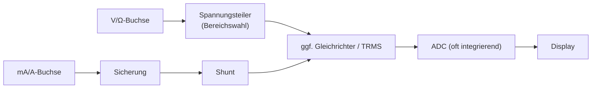

# Recherche-Nachschlagewerk: Voltmeter, Amperemeter & ADC

> [!info] So benutzt du dieses Dokument
> - **Schnell finden:** Obsidian-Gliederung (rechte Seitenleiste „Outline“) oder `Strg+F`.
> - **Quellenkürzel** in eckigen Klammern, z. B. `[ET]`, führen zu [[#12 Quellenschlüssel]].
> - `[LB]` = allgemeines Lehrbuchwissen, nicht aus einer der recherchierten Quellen.
> - 🎤 = kommt so in der Präsentation vor (Folien-Nr. in Klammern).
> - Druckbare Fassung mit klickbarem Inhaltsverzeichnis: `recherche/recherche.tex`.

## Schnellnavigation

| Ich suche … | Abschnitt |
|---|---|
| Wie schließe ich Volt-/Amperemeter an? | [[#2 Voltmeter]] · [[#3 Amperemeter]] |
| Warum zeigt das Messgerät „falsch“ an? | [[#2.3 Belastungsfehler]] · [[#3.3 Bürdenspannung]] · [[#4 Messschaltungen und Messfehler]] |
| Wie funktioniert ein ADC? | [[#5 Analog-Digital-Wandler – Grundlagen]] |
| Welche ADC-Bauarten gibt es? | [[#6 Wandlerverfahren]] |
| Arduino `analogRead()` | [[#7 Praxisbeispiel Arduino Uno (ATmega328P)]] |
| Was steckt im Multimeter? | [[#8 Digitalmultimeter (DMM)]] |
| CAT II / III / IV | [[#9 Sicherheit und Messkategorien]] |
| Alle Formeln auf einen Blick | [[#10 Formelindex]] |
| Begriff unklar | [[#11 Glossar]] |

---

## 1 Grundbegriffe und Messkette

### 1.1 Analog vs. digital
- **Analog:** stufenlos, beliebig viele Zwischenwerte (Spannung, Temperatur, Druck). `[LB]`
- **Digital:** endlich viele Werte (Zahlen); Rechner/Mikrocontroller verarbeiten nur diese. `[LB]`
- Ein ADC „wandelt eine Spannung in eine dazu proportionale Zahl“ um und ermöglicht so die digitale Verarbeitung von Sensorwerten. `[SWISS]`

### 1.2 Die Messkette

🎤 *Folie 2*

### 1.3 Ideales vs. reales Messgerät
Jedes reale Messgerät **beeinflusst** die Schaltung, in der es misst (Rückwirkung). Ziel der Bauweise: diese Rückwirkung minimal halten. `[ET]`

| | ideal | real |
|---|---|---|
| Voltmeter-Innenwiderstand | $R_i = \infty$ | endlich, hoch (typ. ≥ 1 MΩ; DMM ≈ 10 MΩ) `[ET]` `[LB]` |
| Amperemeter-Innenwiderstand | $R_i = 0$ | klein, aber vorhanden (Beispielwert ≈ 5 Ω bei Analoggeräten) `[ET]` |

---

## 2 Voltmeter

### 2.1 Anschluss
- **Parallel** zum Messobjekt – die Spannung wird zwischen zwei Punkten „abgegriffen“. `[ET]` 🎤 (4)

### 2.2 Innenwiderstand
- Soll möglichst **groß** sein, damit kaum Messstrom fließt. `[ET]`
- Digitalmultimeter: typ. **10 MΩ** Eingangswiderstand. `[LB]` (gängiger Herstellerwert; im Datenblatt des eigenen Geräts prüfen)
- Analoge Zeigerinstrumente: Angabe als **Ω/V** (z. B. 20 kΩ/V → im 10-V-Bereich 200 kΩ). Ein 1-mA-Messwerk entspricht 1 kΩ/V. `[EL]`

### 2.3 Belastungsfehler
Der Innenwiderstand liegt **parallel** zum Messobjekt und verkleinert den wirksamen Widerstand → angezeigte Spannung zu klein. `[ET]` 🎤 (4)

> [!example] Rechenbeispiel (nachgerechnet)
> Spannungsteiler $R_1 = R_2 = 1\,\text{M}\Omega$ an $U = 10\,\text{V}$, gemessen über $R_2$ (ideal 5,00 V)
>
> | Messgerät | $R_i$ | $R_2 \parallel R_i$ | Anzeige | Fehler |
> |---|---|---|---|---|
> | ideal | ∞ | 1 MΩ | 5,00 V | 0 % |
> | DMM | 10 MΩ | 0,909 MΩ | 4,76 V | −4,8 % |
> | Zeigerinstrument 20 kΩ/V, 10-V-Bereich | 200 kΩ | 0,167 MΩ | 1,43 V | −71 % |
>
> Rechenweg: $U_2 = U \cdot \dfrac{R_2 \parallel R_i}{R_1 + R_2 \parallel R_i}$

**Faustregel:** Fehler bleibt klein, wenn $R_i \gg R_\text{Messobjekt}$. `[ET]`

### 2.4 Messbereichserweiterung mit Vorwiderstand
- Vorwiderstand **in Reihe** zum Messwerk; je größer, desto höher der Messbereich. `[EL]`
- $R_V = (n-1) \cdot R_i$ mit Erweiterungsfaktor $n = U_\text{neu} / U_\text{alt}$ `[ET]`

> [!example] Beispiel `[EL]`
> Messwerk 100 µA Vollausschlag, $R_i$ = 1 kΩ → Vollausschlag bei 100 mV. Für 10 V: Gesamtwiderstand 100 kΩ → **Vorwiderstand 99 kΩ** ($n = 100$).

- Hochwertige analoge Voltmeter haben zusätzlich einen Dämpfungswiderstand parallel, der Überschwingen reduziert. `[EL]`

---

## 3 Amperemeter

### 3.1 Anschluss
- **In Reihe** – Stromkreis auftrennen, der gesamte Strom fließt durch das Messgerät. `[FLUKE]` `[ET]` 🎤 (5)

### 3.2 Innenwiderstand und Shunt-Prinzip
- Innenwiderstand soll möglichst **klein** sein. `[ET]`
- Im DMM fließt der Strom durch einen genau bekannten **Shunt**; gemessen wird die Spannung daran: $I = U_\text{Shunt} / R_\text{Shunt}$ → Strommessung = Spannungsmessung. `[LB]`

### 3.3 Bürdenspannung
- Spannungsabfall am Amperemeter (Shunt + Sicherung + Leitungen); fehlt der eigentlichen Schaltung. `[LB]`

> [!example] Rechenbeispiel (nachgerechnet)
> Last 25 Ω an 5 V → ideal 200 mA. Mit 1 Ω Shunt: $I = 5\,\text{V}/26\,\Omega = 192\,\text{mA}$ (−3,8 %), Bürdenspannung ≈ 0,19 V.

### 3.4 Messbereichserweiterung mit Shunt (Nebenwiderstand)
- Kleiner Widerstand **parallel** zum Messwerk. `[EL]`
- $R_N = \dfrac{R_i}{n-1}$ mit $n = I_\text{neu} / I_\text{alt}$ `[ET]`
- Beispiel: Messwerk 100 µA / 1 kΩ auf 10 mA ($n = 100$) → $R_N = 1000\,\Omega / 99 \approx 10{,}1\,\Omega$ (nachgerechnet).

### 3.5 Strom messen ohne Auftrennen
- **Stromzange:** AC über Stromwandler-Prinzip, DC über Hall-Sensor. `[LB]`

---

## 4 Messschaltungen und Messfehler

### 4.1 Spannungsrichtige Messung (Stromfehlerschaltung)

*Quelle: `[ET]`*
- Voltmeter direkt am Messobjekt → **U korrekt**, I enthält den Voltmeter-Messstrom (zu groß).
- Geeignet für **kleine** Widerstände (Bedingung $R_{i,V} \gg R$).

### 4.2 Stromrichtige Messung (Spannungsfehlerschaltung)

*Quelle: `[ET]`*
- Amperemeter direkt in Reihe zum Messobjekt, Voltmeter davor → **I korrekt**, U enthält den Spannungsfall am Amperemeter (zu groß).
- Geeignet für **große** Widerstände (Bedingung $R \gg R_{i,A}$).

### 4.3 Fehlerbegriffe

*Quelle: `[ET]`*
- Absoluter Fehler: $\Delta x = x - x_w$ (angezeigter minus wahrer Wert)
- Relativer Fehler: $f_\text{rel} = \Delta x / x_w$ (in %: × 100 %)
- **Güteklasse** (analoge Messgeräte): Fehler in % bezogen auf den **Messbereichsendwert** → bei kleinem Ausschlag ist der relative Fehler deutlich größer (bei halbem Ausschlag doppelt so groß). Deshalb Messbereich so wählen, dass der Zeiger möglichst weit ausschlägt. `[ET]` `[LB]`

---

## 5 Analog-Digital-Wandler – Grundlagen

### 5.1 Die drei Schritte

🎤 *Folie 9*
1. **Abtasten** (zeitdiskret machen) – Momentanwerte in festen Abständen; Abtastrate in Samples/s. `[EP]`
2. **Quantisieren** (wertdiskret machen) – Zuordnung zur nächstgelegenen Stufe. `[EP]`
3. **Codieren** – Stufennummer als Binärzahl. `[SWISS]` `[LB]`

- **Sample & Hold:** Kondensator hält den abgetasteten Wert während der Wandlung konstant. `[LB]`

### 5.2 Auflösung und LSB

🎤 *Folie 10*
- Stufenzahl $2^n$; 8 Bit = 256, 16 Bit = 65 536 Stufen. `[EP]`
- $U_\text{LSB} = U_\text{ref} / 2^n$ — z. B. 8 Bit an 5 V → 19,5 mV; 16 Bit → ≈ 76 µV. `[EP]`

| Bit | Stufen | LSB bei 5 V (nachgerechnet) |
|---:|---:|---:|
| 8 | 256 | 19,53 mV |
| 10 | 1 024 | 4,88 mV |
| 12 | 4 096 | 1,22 mV |
| 16 | 65 536 | 76,3 µV |

### 5.3 Quantisierungsfehler
- Systembedingt **±½ LSB** – nicht vermeidbar. `[SWISS]`
- 🎓 Theoretischer Signal-Rausch-Abstand eines idealen n-Bit-ADC: $\text{SNR} \approx 6{,}02\,n + 1{,}76\ \text{dB}$. `[LB]` (Vertiefung: `[THIEDE]`)

### 5.4 Auflösung ≠ Genauigkeit
- Genauigkeit wird „hauptsächlich durch die Auflösung bestimmt, ist aber nicht gleich der Auflösung“ – weitere Fehler summieren sich. `[SWISS]`
- Weitere Fehlerquellen: **Linearitätsfehler** (nicht abgleichbar; differentielle/integrale Nichtlinearität), **Missing Codes** (Codes, die nie ausgegeben werden, v. a. bei Flash-Wandlern durch Toleranzen). `[SWISS]`
- Außerdem: Referenzspannung, Offset- und Verstärkungsfehler. `[LB]`

### 5.5 Abtasttheorem und Aliasing

🎤 *Folie 11*
- **Nyquist-Shannon:** $f_\text{abt} > 2 \cdot f_\text{max}$, sonst ist keine verlustfreie Rekonstruktion möglich. `[ING]`
- **Aliasing:** Bei Verletzung entsteht bei der Rekonstruktion ein Signal mit **niedrigerer**, falscher Frequenz. `[ING]`
  - Beispiel: 10-kHz-Signal mit 15 kHz abgetastet → Alias-Signal. `[ING]` Alias-Frequenz hier $|15 - 10| = 5\,\text{kHz}$ (nachgerechnet).
- **Anti-Aliasing-Tiefpass** vor dem ADC entfernt Anteile oberhalb der halben Abtastfrequenz (Nyquist-Frequenz). `[ING]`
- Alltagsbezug: Audio-CD 44,1 kHz ↔ Hörgrenze ≈ 20 kHz; Wagenrad-Effekt im Film. `[LB]`

---

## 6 Wandlerverfahren

> [!note] Einteilung nach `[SWISS]`
> **Direkte Verfahren:** Flash/Parallel, Sukzessive Approximation, Zählverfahren · **Indirekte Verfahren:** Dual-Slope (integrierend)

### 6.1 Flash- / Parallelwandler
- Ein Komparator pro Spannungsstufe, alle vergleichen gleichzeitig → **extrem schnell** (bis 750 MS/s genannt), aber aufwendig. `[SWISS]`
- n Bit benötigen $2^n - 1$ Komparatoren (8 Bit → 255). `[LB]`
- Einsatz: Oszilloskope, Video. `[LB]`

### 6.2 Sukzessive Approximation (SAR, Wägeverfahren)

🎤 *Folie 12, 13*
- Binäre Suche mit Zweierpotenzen-Gewichten; Kompromiss aus Geschwindigkeit und Aufwand. `[SWISS]`
- Interner DAC erzeugt die Vergleichsspannung. `[LB]`
- n Bit → n Vergleichsschritte. `[LB]`

> [!example] 4-Bit-Beispiel (nachgerechnet) — $U_\text{ref}$ = 16 V (1 LSB = 1 V), $U_\text{ein}$ = 11,3 V
> | Schritt | Test | Vergleich | ≤ 11,3 V? | Bit |
> |---|---|---|---|---|
> | 1 | 8 | 8 V | ja | 1 |
> | 2 | 4 | 12 V | nein | 0 |
> | 3 | 2 | 10 V | ja | 1 |
> | 4 | 1 | 11 V | ja | 1 |
>
> Ergebnis **1011₂ = 11** → 11 V; Rest 0,3 V < 1 LSB.

### 6.3 Zählverfahren
- Einfach, aber langsam; hohe Auflösungen (> 20 Bit) möglich. `[SWISS]`

### 6.4 Dual-Slope (integrierend)
- Zeitkonstante τ und Taktfrequenz „fallen heraus“ → Genauigkeiten bis 0,01 %; eingesetzt in Digitalvoltmetern. `[SWISS]`
- Unterdrückt Störsignale, wie sie in Industrieumgebungen üblich sind, automatisch. `[ICL]`
- Prinzip: $U_\text{ein}$ wird eine feste Zeit integriert, danach mit $U_\text{ref}$ zurückintegriert; die Rücklaufzeit ist proportional zu $U_\text{ein}$. Integrationszeit = Vielfaches der Netzperiode (20 ms bei 50 Hz) → Netzbrummen mittelt sich heraus. `[LB]`

### 6.5 Sigma-Delta
- Sehr schnelles 1-Bit-Abtasten (Überabtastung) + digitale Filterung → sehr hohe Auflösung (≈ 16–24 Bit). Einsatz: Audio, Waagen, Präzisionsmessung. `[LB]`

### 6.6 Vergleich

🎤 *Folie 12*

| Verfahren | Tempo | Auflösung (typ.) | Einsatz | Quelle |
|---|---|---|---|---|
| Flash | sehr hoch | ≈ 6–8 Bit | Oszilloskop | `[SWISS]` `[LB]` |
| SAR | mittel | ≈ 8–18 Bit | Mikrocontroller | `[SWISS]` `[LB]` |
| Zählverfahren | langsam | hoch (> 20 Bit möglich) | einfache Anwendungen | `[SWISS]` |
| Dual-Slope | langsam | hoch, sehr störfest | Multimeter | `[SWISS]` `[ICL]` |
| Sigma-Delta | langsam–mittel | ≈ 16–24 Bit | Audio, Waagen | `[LB]` |

> [!warning] Richtwerte
> Die Bit- und Geschwindigkeitsbereiche sind typische Größenordnungen und variieren je nach Hersteller.

---

## 7 Praxisbeispiel Arduino Uno (ATmega328P)

| Eigenschaft | Wert | Quelle |
|---|---|---|
| Typ | Sukzessive Approximation (SAR) | `[SW]` |
| Auflösung | 10 Bit (0 … 1023) | `[SW]` |
| Eingänge | 8 gemultiplexte Kanäle ADC0–ADC7 (ADC6/7 nur bei SMD-Gehäusen) | `[SW]` |
| ADC-Takt für volle Auflösung | 50–200 kHz | `[SW]` |
| Typisch bei 16 MHz | Vorteiler 128 → 125 kHz | `[SW]` |
| Wandlungsdauer | 13 ADC-Takte (≈ 104 µs); erste Wandlung 25 Takte | `[SW]` |
| Abtastrate | ≈ 9,6 kSPS | `[SW]` |
| Referenz | AVcc (typ. 5 V), intern 1,1 V, extern über AREF | `[SW]` |

**Umrechnung** (Konvention des Microchip-Datenblatts, `[MCHP]`/`[LB]` – Datenblatt hier nicht erneut geprüft): $\text{Code} = U_\text{ein} \cdot 1024 / U_\text{ref}$ bzw. $U = \text{Code} \cdot U_\text{ref} / 1024$.
> [!note] Häufig in Tutorials auch mit 1023 statt 1024 gerechnet `[SW]` – der Unterschied liegt unter 0,1 %. In der Präsentation wird die Datenblatt-Variante (1024) verwendet.

Beispiele (nachgerechnet): 2,5 V → 512 · `analogRead()` = 300 → 1,46 V · 1 V → 204.

---

## 8 Digitalmultimeter (DMM)

### 8.1 Aufbau

🎤 *Folie 14*

`[LB]` `[FLUKE]`

### 8.2 Stellen und Counts

*Quelle: `[FLUKE]`*
- **3½ Stellen:** drei volle Ziffern + halbe Stelle → max. Anzeige 1 999.
- **4½ Stellen:** max. 19 999.
- Moderne 3½-stellige Geräte: erweiterte Anzeigeumfänge 3 200, 4 000 oder 6 000.
- Beispiel (nachgerechnet): 6 000 Counts im 6-V-Bereich → Auflösung 1 mV.

### 8.3 Genauigkeitsangabe

*Quelle: `[FLUKE]`*
- Format: **±(x % vom Messwert + y Digits)**
- Beispiel: ±(1 % v. Mw. + 2 Digits) bei 100,0 V → wahrer Wert **98,8 … 101,2 V**.
- Typische Grundgenauigkeit: ±(0,7 % + 1 Digit) bis ±(0,1 % + 1 Digit).

### 8.4 TRMS vs. Mittelwert

*Quelle: `[FLUKE]`*
- **Echteffektiv (TRMS):** misst Sinus und Nicht-Sinus korrekt (bis zum angegebenen Crestfaktor).
- **Mittelwertbildend:** korrekt nur bei reinem Sinus; bei verzerrten Signalen oft deutlich zu niedrige Anzeige.

### 8.5 Sicherungen

*Quelle: `[FLUKE]` `[BGHM]`*
- Messgeräte ohne Sicherung in den Stromeingängen nicht in Leistungskreisen über 230 V AC verwenden. `[FLUKE]`
- Hochenergie-Sicherungen; Nennspannung größer als maximal erwartete Spannung. `[FLUKE]`
- Für CAT III/IV: Hochleistungssicherungen mit aufgedruckten Daten (z. B. 1000 V/30 kA) und Prüfzeichen. `[BGHM]`

### 8.6 ICL7106 – der Klassiker

*Quelle: `[ICL]`*
- Monolithischer **3½-stelliger Dual-Slope-ADC**, steuert ein LCD direkt an.
- Vollausschlag 2,000 V oder 200,0 mV (2 000 Counts).
- Rollover-Fehler < 1 Count, Nullpunktdrift < 1 µV/°C.
- Einsatz in Panelmetern/Messgeräten für Spannung, Widerstand, Temperatur, Strom.

### 8.7 Weitere Praxisdetails

*Quelle: `[LB]`*
- Widerstandsmessung: Konstantstrom + Spannungsmessung → nur spannungsfrei messen.
- „Geisterspannungen“ an offenen Leitungen durch hohe Eingangsimpedanz → LoZ-Modus.

---

## 9 Sicherheit und Messkategorien

### 9.1 Messkategorien (DIN EN 61010)

🎤 *Folie 8*

| Kategorie | Anwendungsbereich | Kennwerte laut `[BGHM]` |
|---|---|---|
| CAT I / „CAT 0“ | Stromkreise ohne direkte Netzverbindung (z. B. Batterie) `[BGHM]` `[WIKI]` `[GM]` | – |
| CAT II | Geräte für den Netzbetrieb (Haushaltsgeräte, Elektrowerkzeuge) `[BGHM]` `[GM]` | ≤ 20 A Vorsicherung, ≤ 2 kA Kurzschlussstrom |
| CAT III | Gebäudeinstallation: Verteiler, Leistungsschalter, Verkabelung, fest angeschlossene Verbraucher `[BGHM]` `[GM]` | ≤ 60 A Sicherung, ≤ 10 kA Kurzschlussstrom |
| CAT IV | Anschlussstelle der Niederspannungsinstallation: Zähler, primäre Überstromschutzeinrichtungen `[BGHM]` `[GM]` | ≤ 50 kA Kurzschlussstrom |

- Kategorien sind zusätzlich nach Spannung gestuft (300 V / 600 V / 1000 V); ein Gerät mit CAT IV 600 V kann bei 1000 V nur CAT III erreichen. `[WIKI]`
- Die Kategorien werden heute in **IEC 61010-2-030** (Prüf- und Messstromkreise) geregelt. `[WIKI]`
- **Messleitungen** müssen DIN EN 61010-031 entsprechen und sind mit Kategorie, Bemessungsspannung und zulässigem Strom gekennzeichnet. `[BGHM]`
- Gefährdungen bei ungeeigneten Geräten: elektrischer Schlag, Störlichtbogen, Brand/Explosion. `[BGHM]`

### 9.2 Typische Bedienfehler

*Quelle: `[LB]`*
- Spannung messen, während das Gerät auf **Strom** steht → Kurzschluss über den Shunt.
- Ersatzsicherung mit zu geringem Schaltvermögen.
- Niedrigste Einstufung von Gerät/Leitung/Zubehör gilt für die gesamte Messanordnung.

### 9.3 Organisatorisches

*Quelle: `[LB]`*
- Arbeiten an elektrischen Anlagen: **DGUV Vorschrift 3** – Elektrofachkräfte bzw. elektrotechnisch unterwiesene Personen unter Leitung/Aufsicht einer Elektrofachkraft. Betriebliche Regelungen beachten.

---

## 10 Formelindex

| Nr. | Größe | Formel | Abschnitt |
|---|---|---|---|
| F1 | Spannungsteiler belastet | $U_2 = U \cdot \dfrac{R_2 \parallel R_i}{R_1 + R_2 \parallel R_i}$ | [[#2.3 Belastungsfehler]] |
| F2 | Parallelschaltung | $R_a \parallel R_b = \dfrac{R_a R_b}{R_a + R_b}$ | [[#2.3 Belastungsfehler]] |
| F3 | Erweiterungsfaktor | $n = \dfrac{\text{neuer Bereich}}{\text{alter Bereich}}$ | [[#2.4 Messbereichserweiterung mit Vorwiderstand]] |
| F4 | Vorwiderstand | $R_V = (n-1) R_i$ | [[#2.4 Messbereichserweiterung mit Vorwiderstand]] |
| F5 | Shunt | $R_N = \dfrac{R_i}{n-1}$ | [[#3.4 Messbereichserweiterung mit Shunt (Nebenwiderstand)]] |
| F6 | Shunt-Strom | $I = U_\text{Shunt} / R_\text{Shunt}$ | [[#3.2 Innenwiderstand und Shunt-Prinzip]] |
| F7 | Absoluter / relativer Fehler | $\Delta x = x - x_w$; $f_\text{rel} = \Delta x / x_w$ | [[#4.3 Fehlerbegriffe]] |
| F8 | Stufenzahl | $2^n$ | [[#5.2 Auflösung und LSB]] |
| F9 | LSB | $U_\text{LSB} = U_\text{ref}/2^n$ | [[#5.2 Auflösung und LSB]] |
| F10 | Code | $\lfloor U_\text{ein} \cdot 2^n / U_\text{ref} \rfloor$ | [[#7 Praxisbeispiel Arduino Uno (ATmega328P)]] |
| F11 | Quantisierungsfehler | $\pm\tfrac12$ LSB | [[#5.3 Quantisierungsfehler]] |
| F12 | SNR ideal | $6{,}02\,n + 1{,}76$ dB | [[#5.3 Quantisierungsfehler]] |
| F13 | Abtasttheorem | $f_\text{abt} > 2 f_\text{max}$ | [[#5.5 Abtasttheorem und Aliasing]] |
| F14 | Alias (einfacher Fall $f_\text{abt}/2 < f < f_\text{abt}$) | $f_\text{alias} = f_\text{abt} - f$ | [[#5.5 Abtasttheorem und Aliasing]] |
| F15 | Flash-Komparatoren | $2^n - 1$ | [[#6.1 Flash- / Parallelwandler]] |
| F16 | DMM-Toleranz | $\pm(p\,\% \cdot \text{Anzeige} + d \cdot \text{Digit})$ | [[#8.3 Genauigkeitsangabe]] |

---

## 11 Glossar

| Begriff | Erklärung | → |
|---|---|---|
| **ADC / ADU** | Analog-Digital-Wandler (engl. Analog-to-Digital Converter) | [[#5 Analog-Digital-Wandler – Grundlagen]] |
| **Aliasing** | Falsche, niedrigere Frequenz durch zu langsames Abtasten | [[#5.5 Abtasttheorem und Aliasing]] |
| **Anti-Aliasing-Filter** | Tiefpass vor dem ADC, entfernt Anteile > $f_\text{abt}/2$ | [[#5.5 Abtasttheorem und Aliasing]] |
| **Belastungsfehler** | Verfälschung durch den endlichen Innenwiderstand des Voltmeters | [[#2.3 Belastungsfehler]] |
| **Bürdenspannung** | Spannungsabfall am Amperemeter | [[#3.3 Bürdenspannung]] |
| **CAT I–IV** | Messkategorien nach DIN EN 61010 | [[#9.1 Messkategorien (DIN EN 61010)]] |
| **Counts** | Maximaler Anzeigeumfang eines DMM (z. B. 1 999, 6 000) | [[#8.2 Stellen und Counts]] |
| **Crestfaktor** | Verhältnis Scheitelwert zu Effektivwert; begrenzt TRMS-Genauigkeit | [[#8.4 TRMS vs. Mittelwert]] |
| **DAC** | Digital-Analog-Wandler; steckt intern im SAR-ADC | [[#6.2 Sukzessive Approximation (SAR, Wägeverfahren)]] |
| **Digit** | Einheit der letzten Anzeigestelle eines DMM | [[#8.3 Genauigkeitsangabe]] |
| **Dual-Slope** | Integrierendes ADC-Verfahren, genau und störfest | [[#6.4 Dual-Slope (integrierend)]] |
| **Flash-Wandler** | Paralleler ADC, ein Komparator je Stufe | [[#6.1 Flash- / Parallelwandler]] |
| **Güteklasse** | Fehlerangabe analoger Instrumente in % vom Endwert | [[#4.3 Fehlerbegriffe]] |
| **LSB** | Least Significant Bit – kleinste Stufe des ADC | [[#5.2 Auflösung und LSB]] |
| **Missing Codes** | Codes, die ein ADC nie ausgibt | [[#5.4 Auflösung ≠ Genauigkeit]] |
| **MSB** | Most Significant Bit – höchstwertiges Bit | [[#6.2 Sukzessive Approximation (SAR, Wägeverfahren)]] |
| **Nyquist-Frequenz** | Halbe Abtastfrequenz | [[#5.5 Abtasttheorem und Aliasing]] |
| **Quantisierung** | Zuordnung zu einer endlichen Zahl von Stufen | [[#5.1 Die drei Schritte]] |
| **Sample & Hold** | Halteglied, friert den Abtastwert ein | [[#5.1 Die drei Schritte]] |
| **SAR** | Successive Approximation Register – Wägeverfahren | [[#6.2 Sukzessive Approximation (SAR, Wägeverfahren)]] |
| **Shunt / Nebenwiderstand** | Niederohmiger Messwiderstand für Strommessung | [[#3.2 Innenwiderstand und Shunt-Prinzip]] |
| **Sigma-Delta** | Überabtastender 1-Bit-ADC mit Digitalfilter | [[#6.5 Sigma-Delta]] |
| **TRMS** | True RMS – Echt-Effektivwertmessung | [[#8.4 TRMS vs. Mittelwert]] |
| **Vorwiderstand** | Reihenwiderstand zur Voltmeter-Bereichserweiterung | [[#2.4 Messbereichserweiterung mit Vorwiderstand]] |

---

## 12 Quellenschlüssel

Alle Online-Quellen abgerufen am 01.10.2026. Ausführliche Liste: [[04_Quellen]].

| Kürzel | Quelle |
|---|---|
| `[SWISS]` | Lattmann, M.: *Digitaltechnik Kap. 10 – Analog-Digital-Wandler* (SwissEduc). https://www.swisseduc.ch/informatik/hardware/analog_digital_wandler/docs/script.pdf |
| `[EP]` | ElektronikPraxis: *ADC und DAC – das müssen Sie wissen*. https://www.elektronikpraxis.de/adc-und-dac-das-muessen-sie-wissen-a-6a0f66b98d47358230bad75369307944/ |
| `[ING]` | ingHUB: *Messtechnik – Abtasttheorem & Aliasing*. https://inghub.de/lessons/messtechnik/aliasing.html |
| `[ICL]` | Analog Devices/Intersil: *ICL7106/ICL7107 Datenblatt*. https://www.analog.com/media/en/technical-documentation/data-sheets/icl7106-icl7107.pdf |
| `[SW]` | SiliconWit: *ADC and Analog Signal Acquisition (ATmega328P)*. https://siliconwit.com/education/embedded-programming-atmega328p/adc-analog-signal-acquisition/ |
| `[MCHP]` | Microchip: *ATmega328P Datenblatt* (nicht im Detail ausgewertet). https://www.microchip.com/en-us/product/atmega328p |
| `[ET]` | Elektroniktutor: *Spannungs- und Strommessung*. https://www.elektroniktutor.de/elektrophysik/ui_mess.html |
| `[EL]` | Elektronik-Labor/ELEXS: *Messbereichserweiterung beim Voltmeter*. https://www.elektronik-labor.de/elexs/messen1.html |
| `[FLUKE]` | Fluke: *ABC der Digitalmultimeter* (dt.). https://www.calplus.de/fileuploader/download/download/?d=0&file=custom%2Fupload%2Ffluke-abc-der-dmms-de-cp.pdf |
| `[BGHM]` | BGHM: *Auswahl sicherer handgehaltener Multimeter*. https://www.bghm.de/fileadmin/user_upload/Arbeitsschuetzer/Fachthemen/Elektrotechnik/Auswahl_geeigneter_Handmultimeter.pdf |
| `[GM]` | Gossen Metrawatt: *Measuring categories per IEC 61010-1*. https://www.gossenmetrawatt.de/en/knowledge/measuring-and-test-technology/measuring-categories-per-iec-61010-1/ |
| `[WIKI]` | Wikipedia: *Messkategorie*. https://de.wikipedia.org/wiki/Messkategorie |
| `[THIEDE]` | Thiede, A.: *Elektronik für den Maschinenbau*, Kap. 5 (Uni Paderborn; Vertiefung, nicht im Detail ausgewertet). https://groups.uni-paderborn.de/hfe/lehre/Script_elt_5.pdf |
| `[LB]` | Allgemeines Lehrbuchwissen (z. B. *Fachkunde Elektrotechnik*, Europa-Lehrmittel) – nicht aus den obigen Quellen belegt |
