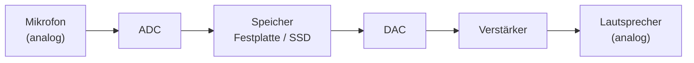
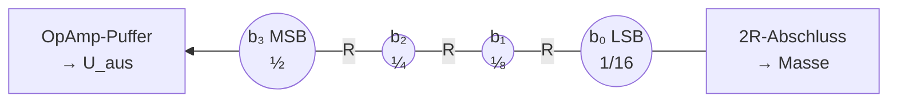
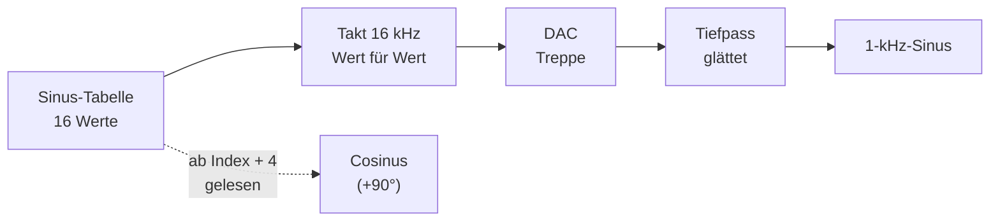

# Folieninhalt & Darstellungsvarianten: DAC

> [!info] So ist dieses Dokument aufgebaut
> Jede Folie hat dieselbe Struktur:
> 1. **Kernaussage** – der *eine* Satz, den das Publikum mitnehmen soll (gut als Folientitel oder Highlight-Box).
> 2. **Folieninhalt** – das, was tatsächlich auf die Folie gehört (max. 3–5 Stichpunkte).
> 3. **Darstellungsvarianten** – 2–3 Layout-Ideen für die Firmenvorlage.
> 4. **Sprechernotiz** – was du dazu *sagst* (nicht auf die Folie schreiben!).
> 5. **Zeit** – Richtwert.
>
> Die Folie mit `⏩ OPTIONAL` streichst du, wenn die Zeit knapp wird („Das zeige ich gern bei Rückfragen“).

## Zeitplan auf einen Blick

| Nr. | Folie | Dauer | Soll-Ende | Status |
|---:|---|---:|---:|---|
| 1 | Titel | 0:15 | 0:15 | fix |
| 2 | Wozu ein DAC? | 0:45 | 1:00 | fix |
| 3 | Vom Code zur Spannung | 0:55 | 1:55 | fix |
| 4 | Das R-2R-Netzwerk | 1:10 | 3:05 | fix |
| 5 | Sinus & Cosinus aus Zahlen | 1:10 | 4:15 | fix |
| 6 | DAC in der Praxis | 0:45 | 5:00 | ⏩ optional |
| 7 | Fazit & Fragen | 0:30 | 5:30 | fix |
| | **Summe** | **5:30** | | ohne Folie 6: **4:45** |

> [!tip] Roter Faden in einem Satz
> „Gespeichert wird digital, gehört und bewegt wird analog – der DAC ist die Brücke zurück.“

---

## Folie 1 – Titel

**Kernaussage:** –

**Folieninhalt**
- Titel: **Vom Bit zurück zum Signal**
- Untertitel: *Der Digital-Analog-Wandler (DAC)*
- Name, Ausbildungsberuf/Jahrgang, Datum (06.10.2026)
- Modul: Ausbildungsinhalte 022 – Grundlagen der Elektrotechnik *(ggf. anpassen)*

**Darstellungsvarianten**
- **A – Klassisch:** Titel-Layout der Firmenvorlage, rechts ein Bild: links Binärzahlen `0110 1101 …`, rechts ein glatter Sinus.
- **B – Bildstark:** Vollflächig eine Treppenkurve, die nach rechts in einen glatten Sinus übergeht; Titel darüber.
- **C – Frage als Titel:** „Wie wird aus einer MP3-Datei wieder Musik?“ (Titel dann im Untertitel).

**Sprechernotiz**
> „Hallo zusammen! Wir speichern heute fast alles digital – Musik, Videos, Messwerte. Aber hören, sehen und bewegen können wir nur analog. Wie die Zahlen wieder zu einem Signal werden, zeige ich euch in den nächsten fünf Minuten.“

**Zeit:** 0:15

---

## Folie 2 – Wozu ein DAC?

**Kernaussage:** Gespeichert und verarbeitet wird **digital** – Lautsprecher, Motoren und unsere Ohren verstehen aber nur **analog**.

**Folieninhalt**
- Musik liegt als **Zahlen** auf Festplatte, SSD oder im Stream – in CD-Qualität 44 100 Zahlen pro Sekunde und Kanal, je 16 Bit
- Ein Lautsprecher braucht eine **stetig veränderliche Spannung**
- Kette: Mikrofon → **ADC** → Speicher → **DAC** → Verstärker → Lautsprecher
- Weitere Beispiele: Funktionsgenerator (Sinus), Sollwert für Motor oder Ventil

**Darstellungsvarianten**
- **A – Kette als Pfeilreihe (empfohlen):** fünf Kästen mit Icons; ADC und DAC farbig hervorgehoben, „Speicher“ in der Mitte als Festplatten-Icon.
- **B – Zwei Welten:** links „digital: speichern, kopieren, verarbeiten“, rechts „analog: hören, sehen, bewegen“, in der Mitte ein Brückensymbol „DAC“.
- **C – Alltagsfoto:** Smartphone + Kopfhörer, Beschriftung „Hier steckt ein DAC drin“.

**Sprechernotiz**
> „Digital hat riesige Vorteile: Ich kann Musik verlustfrei kopieren, auf einer Festplatte speichern und übers Internet schicken. Ein Lautsprecher kann mit Zahlen aber nichts anfangen – seine Membran braucht eine Spannung, die sich stetig ändert. Genau dafür gibt es den DAC: Er ist das Gegenstück zum ADC. Der ADC macht aus dem Signal Zahlen, der DAC macht aus den Zahlen wieder ein Signal. In jedem Handy, jedem Laptop und jedem Bluetooth-Kopfhörer steckt mindestens einer.“

**Zeit:** 0:45

---

## Folie 3 – Vom Code zur Spannung

**Kernaussage:** Jeder Code bekommt eine feste Spannung: **U_aus = Code / 2ⁿ · U_ref** – heraus kommt eine **Treppe** in Schritten von 1 LSB.

**Folieninhalt**
- Beispiel: **4-Bit-DAC, U_ref = 8 V** → 2⁴ = **16 Stufen**, **1 LSB = 8 V / 16 = 0,5 V**
- Jedes Bit hat ein festes **Gewicht**: 4 V · 2 V · 1 V · 0,5 V (MSB → LSB)
- Beispiel: **1101₂ = 13** → 4 V + 2 V + 0 + 0,5 V = **6,5 V**
- Größter Wert: 1111₂ → **7,5 V** (U_ref selbst wird nie ganz erreicht)

**Darstellungsvarianten**
- **A – Kennlinie (empfohlen):** Treppe mit Code (0000 … 1111) auf der x-Achse und Spannung auf der y-Achse; Code 1101 und 6,5 V farbig markiert. *(Im Beamer-Template als pgfplots-Grafik.)*
- **B – Bit-Waage:** vier Gewichte (4 V, 2 V, 1 V, 0,5 V) als Kästen, die bei „1“ farbig sind und sich zu 6,5 V addieren.
- **C – Tabelle:** Bit | Gewicht | bei 1101 – mit Summenzeile.

| Bit | b₃ (MSB) | b₂ | b₁ | b₀ (LSB) | Summe |
|---|---:|---:|---:|---:|---:|
| Gewicht | 4 V | 2 V | 1 V | 0,5 V | |
| 1101 | 1 → 4 V | 1 → 2 V | 0 → 0 V | 1 → 0,5 V | **6,5 V** |

**Sprechernotiz**
> „Ein DAC rechnet eigentlich nur rückwärts: Er bekommt eine Binärzahl und gibt dafür eine Spannung aus. Nehmen wir einen kleinen DAC mit 4 Bit und 8 Volt Referenz. 4 Bit sind 16 Stufen, also ist eine Stufe 0,5 Volt groß – das ist das LSB. Jedes Bit hat ein Gewicht: Das höchste Bit zählt 4 Volt, also die Hälfte der Referenz, das nächste 2 Volt, dann 1 Volt und das kleinste 0,5 Volt. Kurze Frage an euch: Was kommt bei 1101 heraus? *(3 Sekunden warten)* Genau: 4 plus 2 plus 0,5 – macht 6,5 Volt. Wichtig: Dazwischen gibt es nichts. Der DAC springt von Stufe zu Stufe – heraus kommt eine Treppe.“

**Zeit:** 0:55

---

## Folie 4 – Das R-2R-Netzwerk

**Kernaussage:** Mit nur **zwei Widerstandswerten (R und 2R)** halbiert jede Stufe den Beitrag – so bekommt jedes Bit automatisch sein richtiges Gewicht.

**Folieninhalt**
- Leiter aus **R** (Längszweig) und **2R** (Querzweige); jedes Bit schaltet seinen 2R-Zweig an **U_ref (1)** oder **Masse (0)**
- Mit jeder Stufe Richtung Ausgang **halbiert sich der Beitrag** eines Bits → MSB ½, dann ¼, ⅛, 1/16 von U_ref
- Nur **zwei Werte** → auf einem Chip sehr genau herstellbar; für mehr Bit einfach weitere Stufen anhängen
- Ausgang über einen **OpAmp als Puffer**, weil das Netzwerk einen Innenwiderstand von R hat

**Darstellungsvarianten**
- **A – Schaltbild (empfohlen):** 4-Bit-R-2R mit Schaltern; Schalterstellung 1101 eingezeichnet, Ausgang „6,5 V“. *(Im Beamer-Template als circuitikz-Grafik.)*
- **B – Wasser-Analogie:** Wasserlauf, der sich an jeder Verzweigung halbiert (½, ¼, ⅛ …).
- **C – Vorher/Nachher:** links „gewichtete Widerstände R, 2R, 4R, 8R … (8 Bit: bis 128R!)“, rechts „R-2R: immer nur R und 2R“.

*(Jeder Knoten hat zusätzlich einen 2R-Zweig zu seinem Bit-Schalter: 1 = U_ref, 0 = Masse.)*

**Sprechernotiz**
> „Wie baut man so etwas? Die einfachste Idee wären verschieden große Widerstände für jedes Bit – bei 8 Bit bräuchte ich aber Widerstände von R bis 128 R, und alle müssten superexakt sein. Der Trick ist das R-2R-Netzwerk: eine Leiter aus nur zwei Widerstandswerten. Jedes Bit schaltet seinen Zweig entweder an die Referenzspannung oder an Masse. Das Netzwerk ist so gebaut, dass sich der Beitrag eines Bits mit jeder Stufe auf dem Weg zum Ausgang genau halbiert. Deshalb zählt das höchste Bit die Hälfte, das nächste ein Viertel und so weiter – genau die Gewichte von eben. Will ich mehr Bit, hänge ich einfach weitere Stufen an. Und weil nur zwei Werte vorkommen, kann man das auf einem Chip sehr genau herstellen. Am Ausgang sitzt noch ein Operationsverstärker als Puffer, damit die angeschlossene Last die Spannung nicht verfälscht.“

**Zeit:** 1:10

---

## Folie 5 – Sinus & Cosinus aus Zahlen

**Kernaussage:** Ein Sinus wird als **Zahlentabelle** gespeichert; der DAC gibt sie im Takt aus, und ein **Tiefpass** glättet die Treppe zum Sinus.

**Folieninhalt**
- **Wertetabelle** mit 16 Werten pro Periode (8 Bit): 128 · 177 · 218 · 245 · **255** · 245 · … · **1** · …
- DAC-Takt **16 kHz**, 16 Werte pro Periode → **1-kHz-Sinus**
- **Treppe → Tiefpass (Rekonstruktionsfilter) → glatter Sinus**
- **Cosinus** = dieselbe Tabelle, aber **ab Index + 4** gelesen (4 Einträge voraus = ¼ Periode = 90°) – kein zweiter Datensatz nötig
- Abtasttheorem gilt auch hier: Signal **< halber Takt** (hier unter 8 kHz)

**Darstellungsvarianten**
- **A – Drei Kurven übereinander (empfohlen):** Treppe (DAC-Ausgang), darüber gestrichelt der geglättete Sinus, darunter der Cosinus, um 90° versetzt. *(Im Beamer-Template als pgfplots-Grafik.)*
- **B – Ablauf:** Tabelle (Speicher) → Zähler/Takt → DAC → Tiefpass → Oszilloskop-Bild.
- **C – Anwendung zuerst:** Schrittmotor mit zwei Spulen: Spule A bekommt den Sinus, Spule B den Cosinus → Motor dreht sanft (Mikroschritt).

**Sprechernotiz**
> „Jetzt zum spannenden Teil: Wie erzeuge ich einen Sinus? Ich speichere eine Periode als Tabelle – hier 16 Zahlen, die einmal hoch und wieder runter gehen. Der DAC gibt diese Zahlen in einem festen Takt aus, zum Beispiel 16 000 Werte pro Sekunde. 16 Werte pro Periode, 16 000 pro Sekunde – macht genau 1000 Perioden, also einen 1-Kilohertz-Sinus. Direkt am DAC sieht das noch aus wie eine Treppe. Deshalb kommt dahinter ein Tiefpass, der die Kanten glättet – heraus kommt ein sauberer Sinus. Und den Cosinus bekomme ich geschenkt: Er ist nur um eine Viertelperiode verschoben. Ich lese also dieselbe Tabelle, nur vier Einträge voraus. So ein Sinus-Cosinus-Paar braucht man zum Beispiel beim Schrittmotor: Eine Spule bekommt den Sinus, die andere den Cosinus, und der Motor dreht ganz gleichmäßig. Und auch hier gilt das Abtasttheorem: Mit 16 Kilohertz Takt schaffe ich höchstens Signale unter 8 Kilohertz.“

**Zeit:** 1:10

---

## Folie 6 – DAC in der Praxis `⏩ OPTIONAL`

**Kernaussage:** Wie gut ein DAC ist, entscheiden vor allem **Auflösung (Bit)** und **Ausgaberate** – je nach Anwendung von 8 bis 24 Bit.

**Folieninhalt**
- **Auflösung:** mehr Bit → feinere Treppe (8 Bit = 256 Stufen, 16 Bit = 65 536)
- **Ausgaberate:** wie viele Werte pro Sekunde (CD: 44,1 kHz) – begrenzt die höchste Frequenz (Abtasttheorem)
- **Mikrocontroller** (z. B. ESP32): zwei 8-Bit-DACs, sogar mit eingebautem Cosinus-Generator
- **Audio-DACs:** typisch 24 Bit, meist als Sigma-Delta-Wandler gebaut
- Weitere Bauarten: gewichtete Widerstände (selten), PWM + Tiefpass (billig, „Ersatz-DAC“)

**Darstellungsvarianten**
- **A – Steckbrief-Tabelle (empfohlen):** Anwendung | Bit | Rate | Bauart.
- **B – Zwei Treppen:** 3 Bit vs. 6 Bit für denselben Sinus nebeneinander.
- **C – Produktfotos:** ESP32-Board und USB-Kopfhörerverstärker, je mit Datenblatt-Zitat.

| Anwendung | Auflösung | Rate | Bauart |
|---|---:|---:|---|
| ESP32-Mikrocontroller | 8 Bit (2 Kanäle) | einstellbar | mit Cosinus-Generator |
| Audio-CD-Wiedergabe | 16 Bit | 44,1 kHz | meist Sigma-Delta |
| HiFi-/Studio-Audio | 24 Bit | bis 192 kHz | Sigma-Delta |

**Sprechernotiz**
> „Ganz kurz noch, worauf man bei einem DAC achtet: Die Bitzahl bestimmt, wie fein die Treppe ist. Die Ausgaberate bestimmt, wie schnell sich das Signal ändern kann – und damit über das Abtasttheorem die höchste Frequenz. Ein ESP32-Mikrocontroller hat zum Beispiel zwei 8-Bit-DACs und sogar einen eingebauten Cosinus-Generator. In Audiogeräten stecken dagegen 24-Bit-DACs, meistens nach dem Sigma-Delta-Prinzip.“

**Zeit:** 0:45

---

## Folie 7 – Fazit & Fragen

**Kernaussage:** Der DAC ist die Brücke von den Zahlen zurück in die analoge Welt.

**Folieninhalt – 3 Take-aways**
1. **DAC = Code → Spannung:** U_aus = Code / 2ⁿ · U_ref, Ergebnis ist eine Treppe (1 LSB pro Stufe)
2. **R-2R-Netzwerk:** nur zwei Widerstandswerte, jede Stufe halbiert → binäre Gewichte
3. **Treppe + Tiefpass = glattes Signal:** Sinus und Cosinus kommen aus derselben Tabelle; das Abtasttheorem gilt auch rückwärts

**Darstellungsvarianten**
- **A – Drei nummerierte Kästen** + „Fragen?“ groß unten.
- **B – Rückblick-Kette:** die Kette von Folie 2, der DAC-Kasten groß hervorgehoben, darunter die drei Take-aways.
- **C – Bild-Klammer:** das Titelbild (Zahlen → Sinus) wiederholt, die drei Take-aways darauf.

**Sprechernotiz**
> „Zusammengefasst: Erstens – der DAC macht aus einem Code eine Spannung, Stufe für Stufe. Zweitens – im R-2R-Netzwerk reichen dafür zwei Widerstandswerte, weil sich der Beitrag mit jeder Stufe halbiert. Drittens – aus der Treppe wird mit einem Tiefpass ein glattes Signal, und Sinus und Cosinus kommen aus derselben Tabelle. Danke fürs Zuhören – habt ihr Fragen?“

**Zeit:** 0:30

---

## Anhang: Backup-Folien (nur bei Rückfragen zeigen)

### B1 – Warum halbiert sich der Beitrag mit jeder Stufe?
*(„rechts“ = Richtung LSB, wie im Schaltbild)*
- Ganz rechts: zwei 2R parallel (Bit-Zweig + Abschluss) = **R**
- Alles rechts von einem Knoten wirkt wie eine Spannungsquelle mit Innenwiderstand **R**; mit dem Längs-R in Reihe → **2R**
- Zusammen mit dem **2R**-Zweig am nächsten Knoten → Spannungsteiler **1 : 1** → der Beitrag halbiert sich pro Stufe
- Das wiederholt sich Stufe für Stufe → ½, ¼, ⅛, …
- *Rückfrage-Extra:* Beim **Strommodus**-R-2R (Ausgang an einem OpAmp, der auf 0 V hält) halbiert sich tatsächlich der **Strom** an jedem Knoten.

### B2 – Gewichtete Widerstände vs. R-2R
| | Gewichtete Widerstände | R-2R-Netzwerk |
|---|---|---|
| Widerstandswerte (8 Bit) | 8 verschiedene: R … 128R | 2: R und 2R |
| Anzahl Widerstände (8 Bit) | 8 (+ Rückkopplung) | 16 (2n) |
| Fertigung | schwer genau, Verhältnis 1 : 128 | einfach, gut abgleichbar |
| Einsatz | Lehrbeispiel, wenige Bit | Standard für Widerstands-DACs |

### B2b – Warum so genaue Widerstände? *(in der .tex Teil von Backup B2)*
- Das MSB trägt die halbe Ausgangsspannung → ein Fehler dort wirkt am stärksten
- Simulation (8 Bit, LSB = 10 mV): MSB-2R-Zweig **2 % zu groß** → Schritt von Code 127 auf 128 ist **−15 mV** statt +10 mV
- Die Ausgangsspannung **sinkt** dann, obwohl der Code steigt → der DAC ist **nicht mehr monoton**
